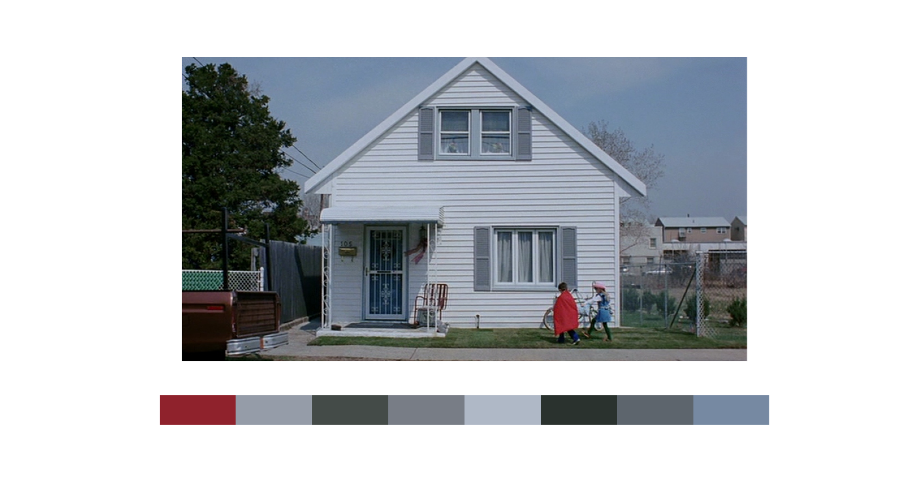
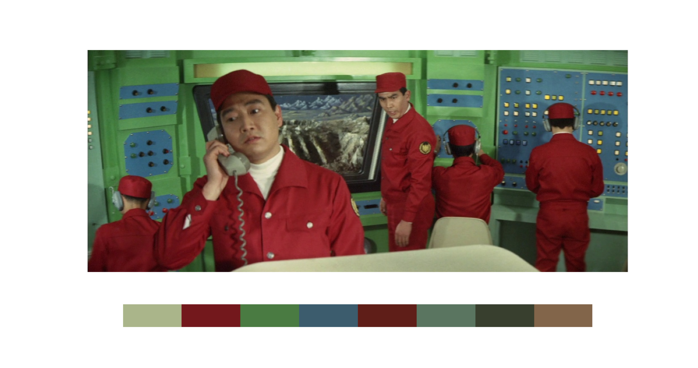
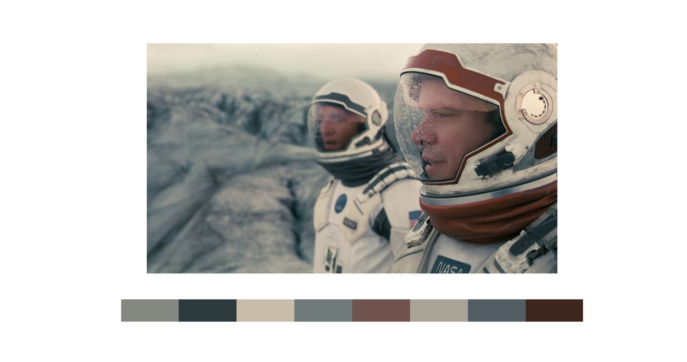
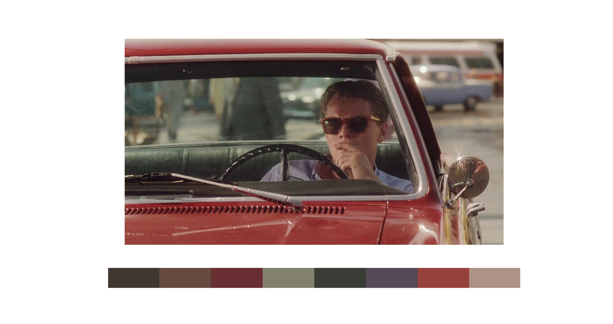
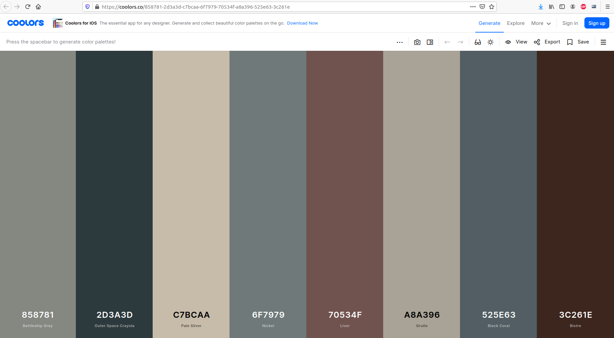

# Color Palette Extractor

[Fun project] Extracts the color palette of a given image and returns a link to "Coolors" webiste with the corresponding palette.

## Main Python Package Requirements

- Numpy
- Matplotlib
- PIL
- Sklearn

## Usage

### Step 1: Download this repository

Clone this repository on your own machine.

```
git clone https://github.com/smorantg2/color_palette_extractor
```

### Step 2: Select the desired parameters and run!

```
low_cutoff              Threshold to remove pixels with too low light and avoid too many dark colors or blacks in the palette [0-1]
high_cutoff             Threshold to remove pixels with too high light and avoid too many bright colors or whites in the palette [0-1]
n_colors                Number of colors to be extracted. Please note that Coolors website links will work with a maximum of 10 colors
key_palette             Select the method and color space to be used:
                            #Key 1 = KMeans + RGB color space 
                            #Key 2 = KMeans + HSV color space 
                            #Key 3 = Gaussian Mixture + RGB color space 
                            #Key 4 = Gaussian Mixture + HSV color space

```

## Demo

### KMeans clustering in RGB color space

<span>
   
</span>

https://coolors.co/8f222c-959ca8-444b48-787d86-afb8c6-2a322e-5d656d-7689a2

### KMeans clustering in HSV color space

<span>
   
</span>

https://coolors.co/aab58a-73181c-4a7b42-3c5c6d-5f1e18-5a7560-383f2e-82654a

### GaussianMixture clustering in RGB color space

<span>
   
</span>

https://coolors.co/858781-2d3a3d-c7bcaa-6f7979-70534f-a8a396-525e63-3c261e

### GaussianMixture clustering in HSV color space

<span>
   
</span>

https://coolors.co/413732-674a3f-682e32-82806f-393d36-554b56-96413b-ab9485 

The system automatically generates a link to [Coolors webiste](https://coolors.co/) with the corresponding color palette:

<span>
   
</span>


## References

Inspired and based on this [article](https://towardsdatascience.com/algorithmic-color-palettes-a110d6448b5d).
